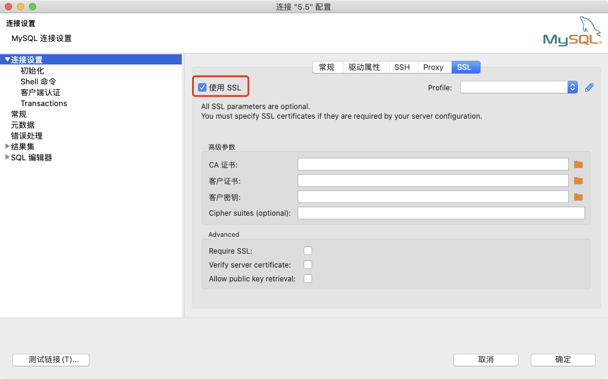

# 配置 SSL 证书 
云数据库 MySQL, MariaDB, Percona 连接方式支持明文的，也支持加密的，如果要支持加密的连接方式，需要在连接参数中配置 SSL 证书。
采用加密的连接方式，即使你通过公网访问云数据库 MySQL, MariaDB, Percona，即使数据传输内容被截获，传输内容也是被加密的，无法被识别。

## 注意事项
* 新购实例 SSL 功能默认关闭，如果要启用，需要手动开启。
* 开启TDE后将无法开启SSL。
* 开启SSL需要重启实例，请谨慎操作。
* SSL开启后暂不支持关闭。

## 操作步骤
1. 登录[数据库控制台](https://rds-console.jdcloud.com/rds/database)。
2. 点击需要设置SSL证书的实例名称进入实例详情
3. 点击开启SSl开关进行SSL证书开启。
4. 点击下载 [SSL 证书](https://jddb-common-public.s3.cn-north-1.jdcloud-oss.com/jdcloud-rds-ca.pem)。
5. 打开所下载的.pem文件，获取对应证书。


## 设置SSL　CA证书

开通SSL加密后，应用或者客户端连接RDS时需要配置SSL CA证书。下面以MySQL命令行和Navicat为例，介绍SSL CA证书安装方法。

### MySQL命令行方式设置  

 下面以 MySQL 5.7 为例，通过命令行的方式连接数据库

   ```SQL
   # SSL 证书为上一步下载的证书文件所在路径
   mysql -h [域名] -P [端口] -u [用户名] -p [密码] --ssl-ca [SSL 证书]
   ```

  可以通过MySQL状态检查连接类型，如果值不为空就表示连接方式为SSL
   ```SQL
   mysql> show status like 'ssl_cipher';
   +---------------+--------------------+
   | Variable_name | Value              |
   +---------------+--------------------+
   | Ssl_cipher    | DHE-RSA-AES256-SHA |
   +---------------+--------------------+
   1 row in set (0.01 sec)
   ```
   
### Navicat方式设置  
1. 打开Navicat。
2. 点击进入MySQL连接设置。
3. 按照下图进行设置。  

  