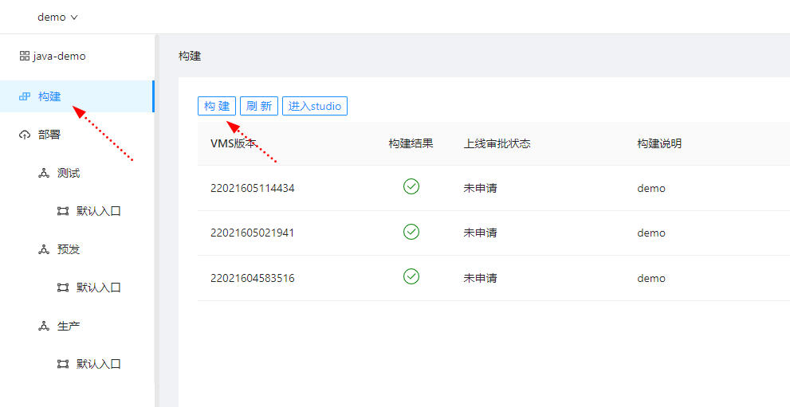
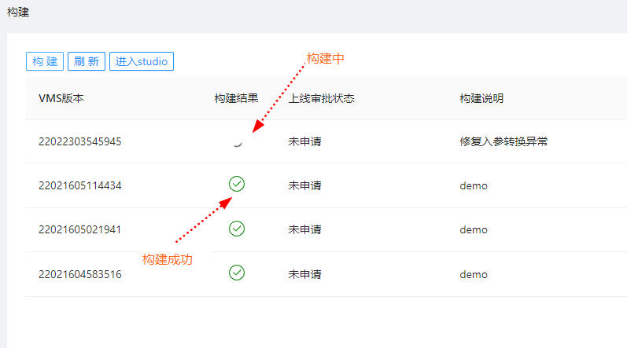
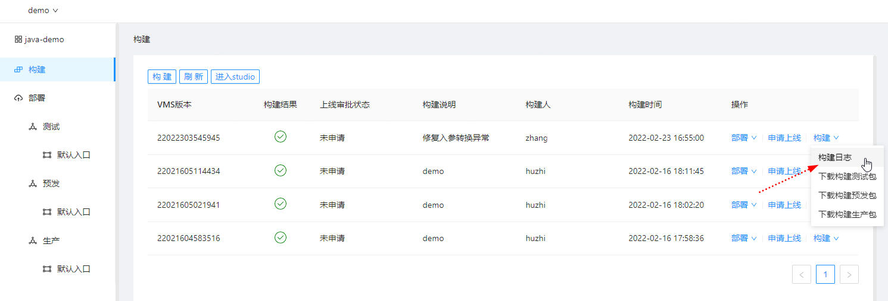
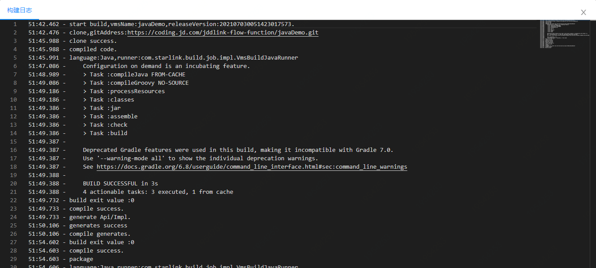
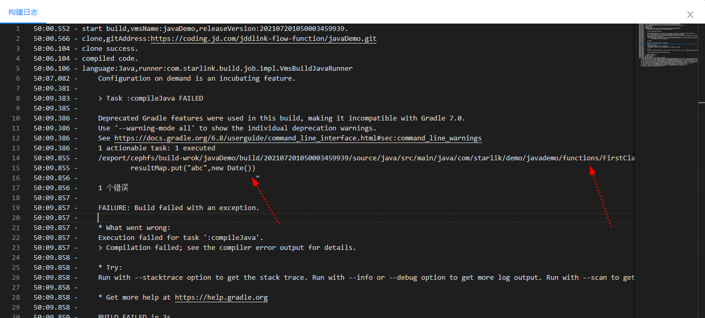

# 构建

## 构建

* 点击 "可视化微服务"  - “部署按钮”
  
  
  
  
* 选择构建菜单
  
  
  
  
* 单击构建按钮弹出如下对话框
  输入本次构建的说明，便于审核、部署时能够区分每个版本的差异。
  单击"确定"，开始构建。

  > - 强烈建议输入一些有意义的、与本次构建内容相关的说明。
  > - 系统构建时，**默认拉取master分支**。请确认master分支已是最新代码。
  >

  

  构建结果如下图，如构建异常请在构建日志处查看具体原因。
  

## 构建日志

点击“构建日志”，弹出如下提示框，可以了解编译进度、编译异常信息、语法错误等。

语法错误等信息，会体现在构建日志中，如下界面

## 构建包下载

如下图所示，支持下载编译好的包。

## 申请上线

当前支持测试、测试、生产三套部署环境。

-   测试、预发，不需要审批，编译好后可以直接部署。
-   生产环境，需要审批通过后才能部署。

单击“申请上线”，启动上线审批流程。