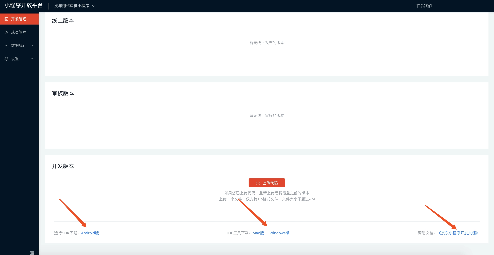
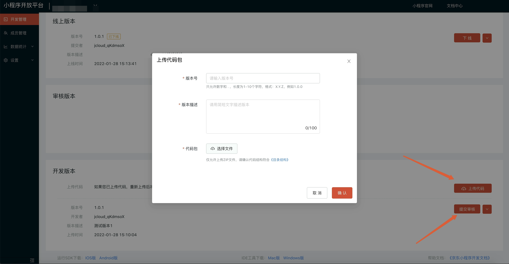
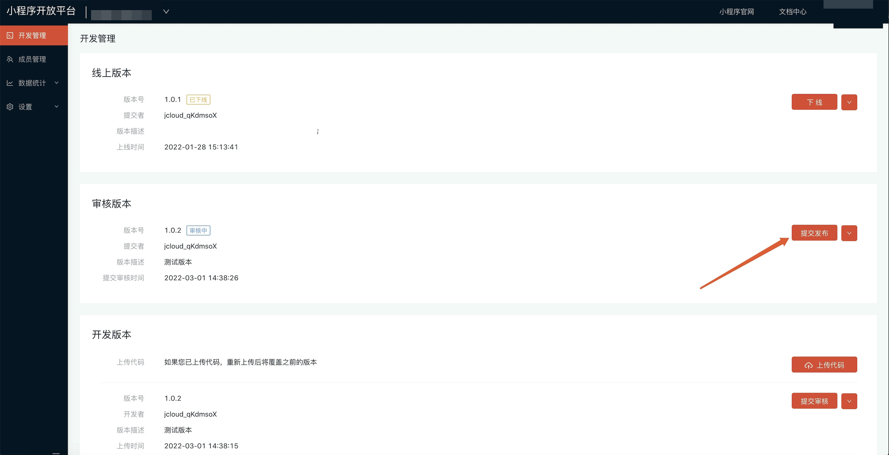
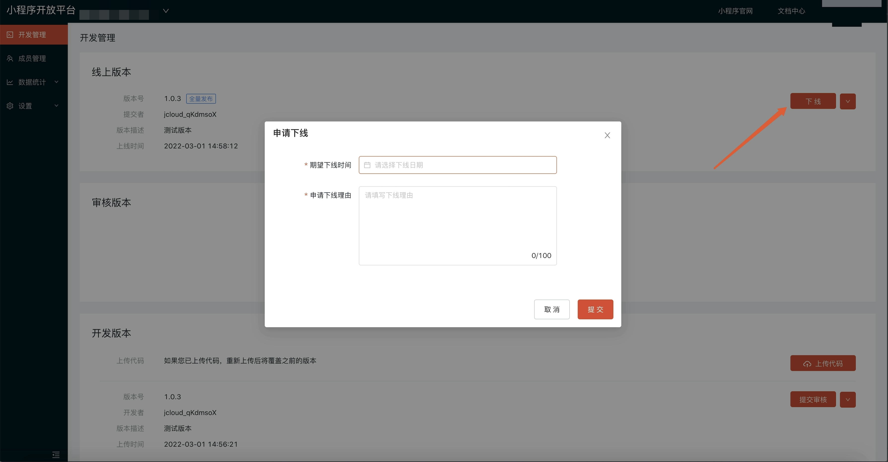
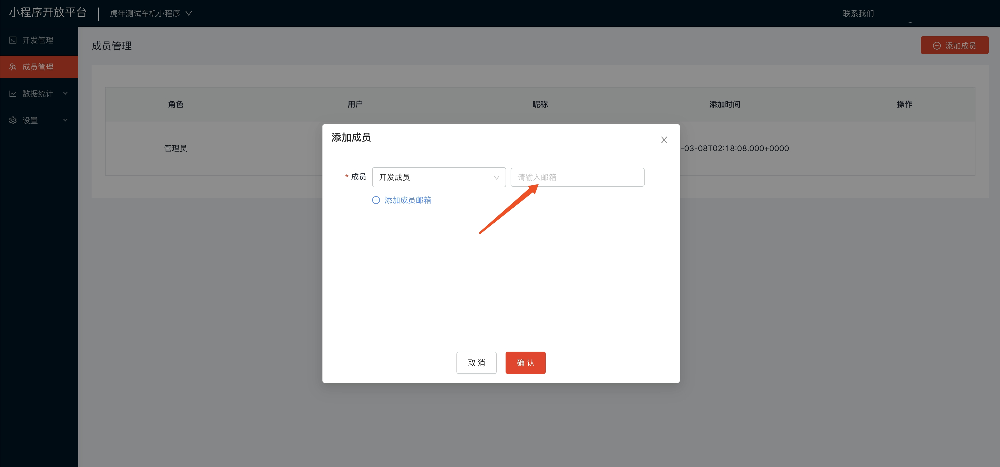
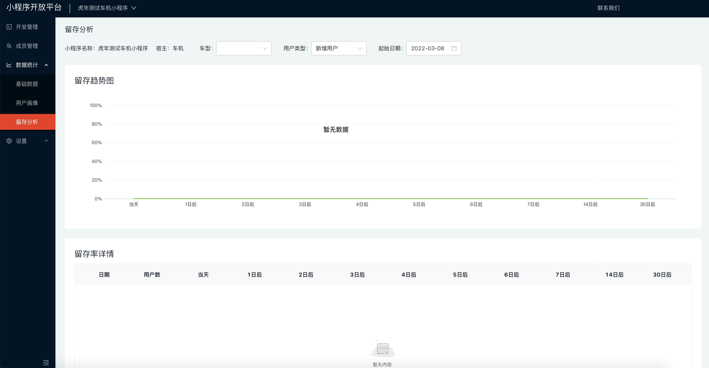
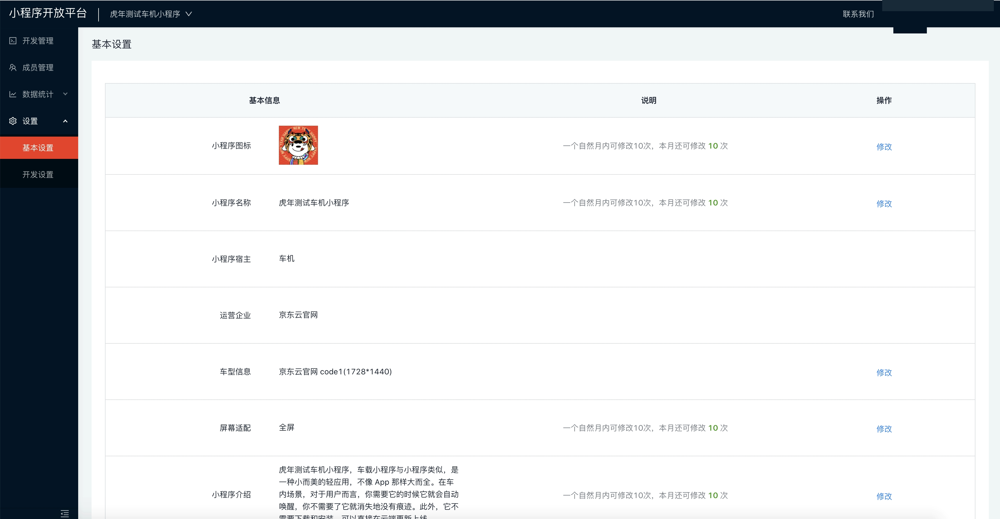

# 创建小程序

## 前提条件
[账号实名认证](./Precondition.md)

## 创建小程序

1. [登录控制台](./ControllPage.md)

2. 点击“小程序服务”菜单

   点击控制台左侧的“小程序服务“菜单后，点击”点击使用小程序“或者图片您都可以进入到“小程序管理云平台
   

3. 使用小程序服务

   进入“小程序管理平台”后，您可以管理小程序、下载小程序开发IDE工具、公版小程序运行App，小程序相关技术文档您也可在“小程序管理平台”上下载
   
4. 创建小程序
   进入“小程序管理平台”后，页面的右上角或用户名下方，可见创建小程序按钮，您可以点击创建小程序，来新建属于自己得小程序
   
   其中分为手机和车机两种：
   
   然后根据提示信息填写，提交即可：
   

## 管理小程序
1. 开发管理
   您可以在已创建的小程序列表中可见 开发管理按钮
   
   开发管理可分为四步：
   1. 下载 sdk、IDE工具以及京东小程序开发文档
   进入开发管理页面后可见底部有运行 sdk下载、IDE工具下载 以及京东小程序开发文档
   
   2. 根据要求生成代码包，上传代码包，并提交审核，然后联系对应的管理人员，管理人员
   
   
   3. 待审核通过后，即可提交发布，小程序发布及上线
   
   4. 最后如果您小程序的需要下线
   
2. 成员管理
   您可以为您的小程序添加管理成员
   
   需要填写被添加的成员邮箱，操作成功后，需要被添加成员在收到的小程序邮件中进行认证，认证完成便可成为您的小程序管理员
   

3. 数据统计
   在您的小程序上线后，您可以在数据统计页面关于您的小程序的相关统计数据，为您提供分析
   1. 基础数据
      
   2. 用户画像
      
   3. 留存分析
      
4. 设置
   小程序创建之后，您还可以其进行设置修改
   1. 基础设置
      
   2. 开发设置
      