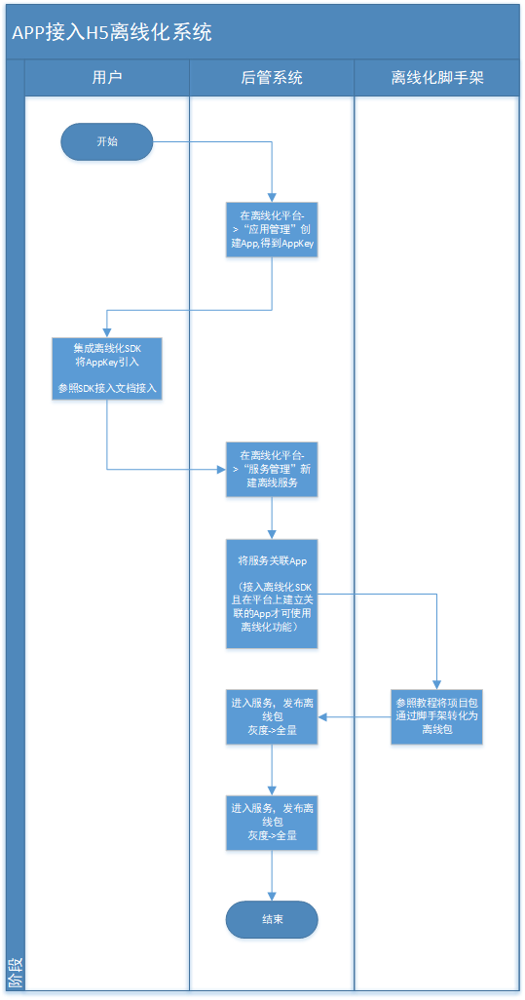
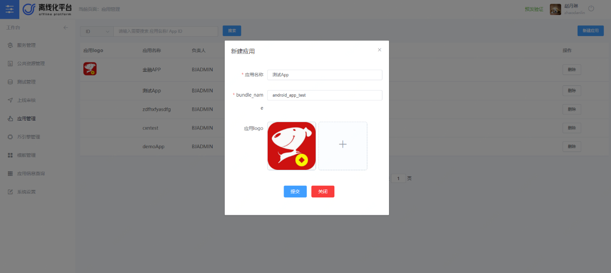
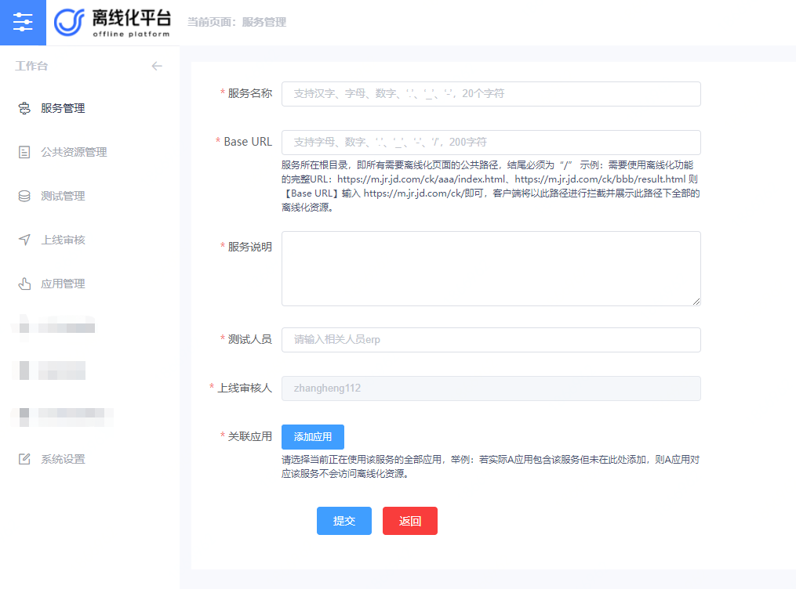
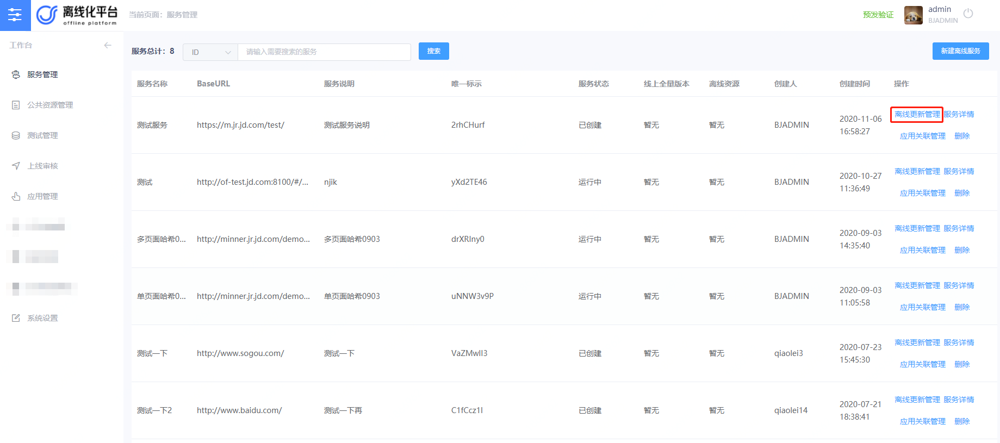
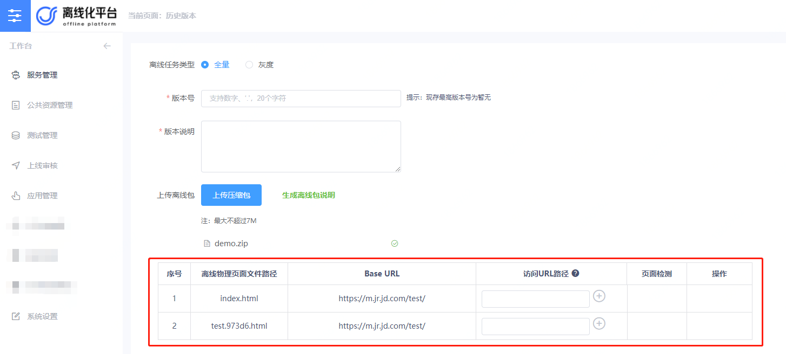
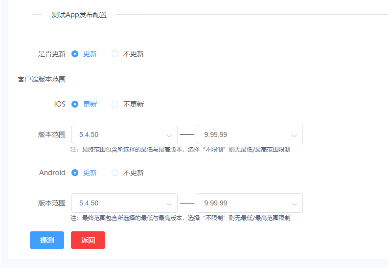
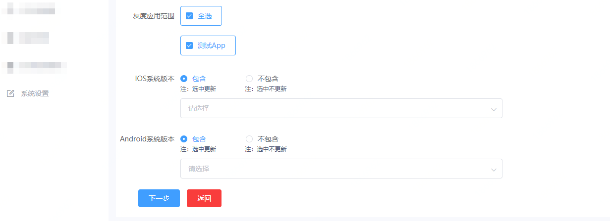
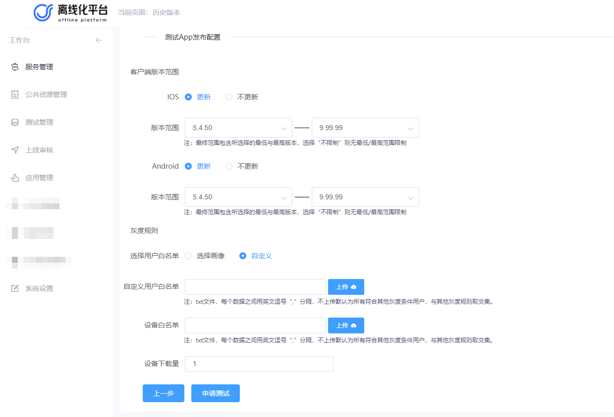

# 产品功能操作说明

## App接入

App接入离线化系统，首先，客户端需要集成相关SDK以支持App对于离线包的处理。第二，用户需要在H5离线化管理平台对离线包进行版本的发布、管理，以支持客户端离线包的实时覆盖更新。具体流程如下图所示

在平台新建App，点击左侧菜单栏“应用管理”，点击“新建应用”。如下图所示

填写App基本信息后，点击确定，即可在列表复制此App的APP KEY，初始化SDK时引入，参照SDK接入文档将SDK集成至APP。如下图所示

## 新服务接入

H5项目可以作为一个服务接入离线化管理平台，并且可以关联多个App，关联成功后，所有使用此H5项目的App均可使用离线化服务。

### 新建服务

点击进入左侧菜单栏“服务管理”，点击右上角新建服务。如下图所示

填写服务，即H5项目包的基础信息，Base URL为每一个服务的唯一标识，不可重复创建，请参照注释填写。选择关联应用，在此处添加的应用均可使用此服务的离线化版本。如下图所示

### 更新离线包——全量

从服务列表找到对应服务，进入离线更新管理，进行新版离线包的发布。如下图所示

点击“新建离线任务”后，填写离线包版本内容。上传压缩包后，系统将会读出zip包内的所有物理文件，用户需要将“访问URL路径”填写完整，具体规则为：每个“离线物理页面文件路径”对应到的“Base URL”+ “访问URL路径”= 线上真实页面URL即可。且支持路由形式页面文件。如下图所示

参照注释填写其他配置项。如下图所示

按照不同App配置相关发布信息后，点击“提测”。等待测试、审批通过后，即可在服务的“离线更新管理”列表页看到“任务类型”为“全量”，发布状态变为“已发布”。

### 更新离线包——灰度

在新建离线任务时，“离线任务类型”选择“灰度”。如下图所示

配置灰度信息后，申请测试，等待测试、审批通过后即可在“离线更新管理”列表页看到“任务类型”为“灰度”，发布状态变为“已发布”。